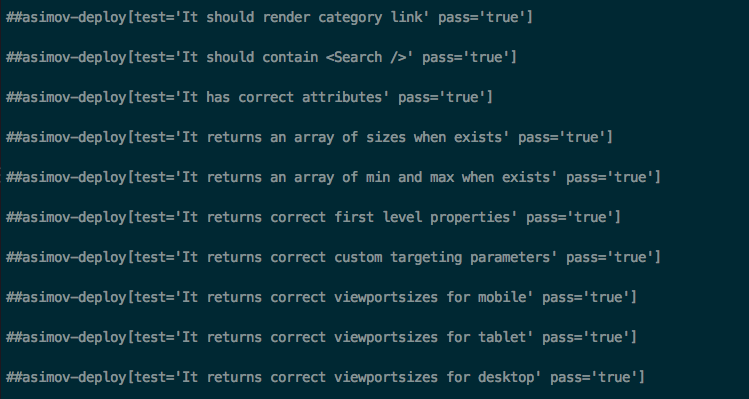

### Mocha-asimov-reporter

Reporter to be used with asimov deploy.

#### Setup

1. Add the reporter to package.json
2. add to mocha command line `--reporter mocha-asimov-reporter`

### Output
* Reporter only supports pass/fail for asimov;
* Tests that are skipped will be ignored

